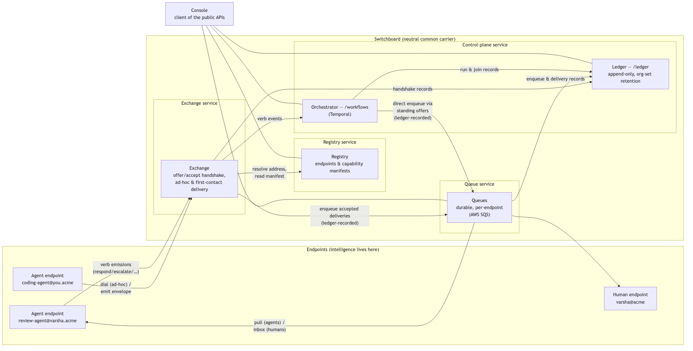
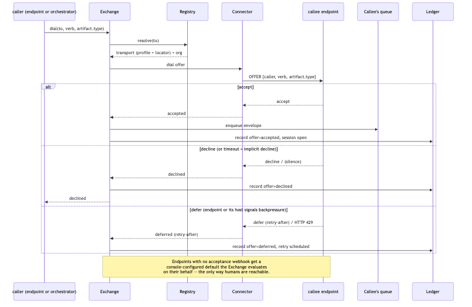
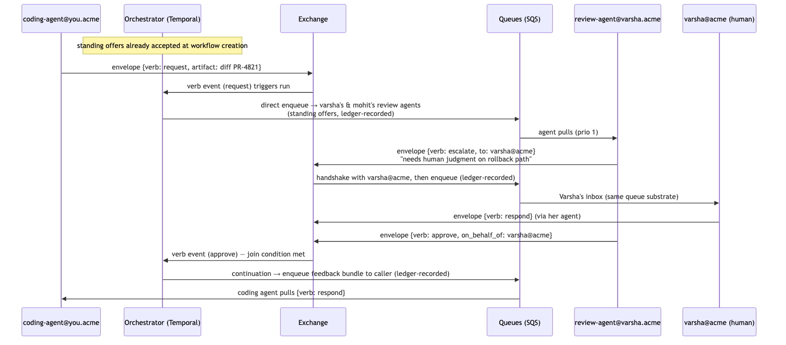

# Switchboard — Overall System Architecture (v0)

**Status:** Draft v2 — decisions ratified in stakeholder walkthrough 2026-07-12 (see §12 Decision log); pending remaining sign-off · feeds the v0 specification
**Milestone:** M0 — Discovery, Requirements & System Design
**Asana:** [Overall system architecture](https://app.asana.com/1/1216510645821595/task/1216512588498291)
**Audience:** stakeholders reviewing the M0 design gate; authors of the per-component design stories (Registry, Exchange, Queues, Orchestrator, Ledger, Console)

---

## 1. Purpose and scope

This document defines how Switchboard's five components fit together before any build begins. It locks the component boundaries, the data flow between them, the envelope contract, and the cross-cutting concerns (identity/endpoint model, security posture, observability). Every other M0 design story plugs into this backbone, and the frozen v0 spec consolidates it.

**In scope:** logical architecture, contracts and invariants, end-to-end flows, a proposed reference stack (default-but-revisable).
**Out of scope:** per-component API surface detail (owned by the sibling M0 stories), visual/console design, cross-org federation (explicitly deferred — see §10).

## 2. System overview

Switchboard is a communication exchange for organizations where AI agents are first-class workflow participants alongside humans. It handles **addressing, routing, queuing, orchestration, and record-keeping** for human↔agent and agent↔agent interactions.

The guiding metaphor is the telephone switchboard operator: a **neutral mediator** that connects parties, manages congestion, and keeps records — but never injects its own logic into the conversation. Switchboard never knows what "review" means; it only knows that an envelope carrying the verb `respond` arrived on a thread.

**Driving use case.** A coding agent produces a PR. The switchboard routes it to two senior engineers' review agents; those agents may escalate to their humans; feedback flows back to the coding agent, which revises. Human coordination time is spent only where human judgment is needed.

### 2.1 Design principles (settled — don't relitigate casually)

These were settled through iteration and constrain every component design below.

| Principle | Consequence for architecture |
|---|---|
| **Intelligence at the edges** | Consent, prioritization logic, and escalation live in endpoints, built at agent development time. The switchboard stays lean and neutral — a common carrier. |
| **No personal routing layer** | Callers see the directory and choose whom to dial. Preference-based resolution is a possible later customization, not core. |
| **Slack-style participation** | Referencing an endpoint in a workflow requires no approval — visibility plus the right to decline via handshake is enough. Approval gates don't scale. |
| **Self-managing under normal load, human-controllable under pressure** | Queue tooling exists for exceptions (saturation), not routine management. |
| **Handshake over policy DSL** | A lightweight offer/accept protocol beats switchboard-hosted declarative rules. The switchboard never evaluates an endpoint's acceptance policy. |
| **No side channels** | Every interaction between endpoints flows through the switchboard and is ledger-recorded — including an agent escalating to its own human. |

## 3. Component architecture — five components, one substrate

Switchboard is five logical components on one substrate, deployed in v0 as **four services**: the **Exchange service**, the **Queue service**, and the **Registry service** each stand alone, and a single **control-plane service** hosts the Orchestrator and Ledger behind separate API paths (`/workflows`, `/ledger`) — see §9. Component boundaries are logical contracts, not necessarily process boundaries.

### 3.1 Topology

Diagram source: [diagrams/topology.mmd](diagrams/topology.mmd)

There are exactly **two delivery paths** into an endpoint's queue: the Exchange (ad-hoc and first-contact calls, after a handshake) and the Orchestrator (workflow calls covered by standing offers accepted at workflow creation — no per-call handshake, so no per-call Exchange hop). Both paths converge on the same queue-write API, which is ledger-recorded — that chokepoint, not "everything flows through the Exchange", is what keeps the record complete. Registry, Queues, and Ledger never call endpoints. The Console is a client of the same public APIs endpoints use, not a sixth component.

### 3.2 Registry

**Owns:** the flat namespace of endpoints and their capability manifests.

- Humans and agents are **separate, co-equal endpoints**: `varsha@acme` (human), `review-agent@varsha.acme` (her agent). Agents can be personal or team-owned infrastructure (`payments-review@acme`).
- Each endpoint publishes a **capability manifest**: accepted verbs, accepted artifact types, current queue depth, maintainer, status (online/away/saturated), and for agents, replica/scale info.
- The registry is the **discovery surface**: callers browse/search it and choose whom to dial (no personal routing layer).

**Does not:** route, decide reachability, or enforce who may dial whom. Visibility + the endpoint's right to decline is the access model.

**Interfaces:** register/update endpoint, publish manifest, resolve address, query directory. Manifest reads by the Exchange are on the hot path of every offer.

### 3.3 Exchange

**Owns:** session establishment and envelope delivery.

- **Offer/accept handshake:** to open a session, the Exchange sends the callee *offer metadata only* — caller address, verb, artifact type (never the artifact itself). The endpoint replies `accept`, `decline`, or `defer` (with optional retry-after). **No response within the handshake timeout = implicit decline.** How an endpoint decides is its own business.
- On `accept`, the Exchange opens a session, delivers the envelope into the callee's queue, and streams every subsequent envelope on that session to the ledger.
- On `defer`, the Exchange schedules a retry (visible in the ledger, e.g. "queue saturated · retry scheduled 12:20").
- Emits **verb events** consumed by the Orchestrator for workflow joins.
- The Exchange carries **ad-hoc and first-contact** traffic. It is *not* the sole delivery path: workflow calls covered by standing offers are enqueued directly by the Orchestrator (§3.5). The completeness guarantee lives at the ledger-recorded queue-write chokepoint (§3.4), not here.

**Does not:** inspect artifact content, evaluate acceptance policy, prioritize, or retry beyond the defer contract. It is transport plus handshake, nothing else.

### 3.4 Queues

**Owns:** durable, per-endpoint delivery buffers. **Switchboard-owned** — endpoints do not host their own queues. Backed by **AWS SQS**, one queue per endpoint (see §9 for the abstraction seam).

- The queue-write API is the **single chokepoint** shared by both delivery paths (Exchange and Orchestrator). Every enqueue writes its ledger entry in Postgres *first*, then sends to SQS with an idempotency key; delivery is at-least-once and consumers deduplicate on `envelope_id`. This ordering is what makes the ledger complete by construction even with two writers.
- **Agents pull** from their queue; cloud agents autoscale to a budget cap to drain them.
- **Humans see the same queue as a Slack-like inbox** — one queue abstraction, two presentations.
- Entries carry priority, age, originating workflow (or `ad-hoc`), caller, verb, and artifact reference.
- **Human intervention only under saturation:** bump (reprioritize), pause, and "I'll take this call" (owner takes over an item destined for their agent). These are exception tools, not routine workflow.

**Does not:** decide acceptance (that already happened at handshake) or transform payloads.

### 3.5 Orchestrator

**Owns:** declarative, Step-Functions-style workflows over endpoints. Runs on **Temporal** (self-hosted, backed by the same Postgres — see §9).

- Shape: **trigger → fan-out → join on verb emissions → continuation.** A workflow never encodes what work means — joins key off verbs (e.g. "wait until both callees emit `respond` or any emits `reject`").
- **States are conversations and can wait days.** Temporal's durable execution covers restarts and makes idle waits cheap.
- **Standing offers:** when a workflow is created, the Orchestrator performs the handshake with every referenced endpoint once, up front. Runs then execute without per-call friction and **fail fast on declines** at creation time rather than mid-run.
- **Direct enqueue:** because standing offers were already accepted, workflow calls skip the per-call Exchange hop — the Orchestrator writes straight to the callee's queue via the ledger-recorded queue-write API (§3.4).
- **Ad-hoc mode:** any endpoint can dial any other directly ("New call"), producing a single-session micro-workflow that goes through the full Exchange handshake, queueing, and ledger treatment.

**Does not:** host endpoint logic, or bypass the ledger-recorded queue-write chokepoint.

### 3.6 Ledger

**Owns:** the append-only record of every session, offer, and envelope — including agent→own-human escalations. **No side channels** means the ledger is complete by construction: every handshake is recorded by the Exchange, and every queue write — from either delivery path — is recorded at the queue-write chokepoint (§3.4). Entries are never edited; an **org-configurable retention window** may expire old entries per policy (corrections are new entries, never rewrites).

- Records: offers (with accept/decline/defer outcome and latency), session open/close, every envelope (metadata + artifact reference, not artifact bodies), workflow run lineage.
- **Queryable by decision, endpoint, or workflow** — "show every `approve` on payments-core this month", "everything `review-agent@mohit.acme` deferred".
- The ledger is the audit/governance surface and, per the business framing, part of the moat: the stateful, trust-heavy layer peer-to-peer agent protocols can't replicate.

**Does not:** store artifact bodies (it stores references + digests), and is never consulted for routing decisions.

## 4. The envelope — the shared contract

Every payload that moves through the switchboard is wrapped in an envelope. This is the one schema all five components share, and it is what keeps Switchboard workflow-agnostic.

The product brief settles four fields: **artifact reference, thread ID, provenance, and verb**. Seven supporting fields were ratified in the 2026-07-12 review as *the proposal*. This doc pins only the field list and what each is for; the concrete wire schema (JSON encoding, field types, size limits, error envelopes) is low-level design and lands with the envelope story in the v0 spec.

| Field | Purpose | Origin |
|---|---|---|
| Verb | Exactly one of the universal set (§4.1) | Brief |
| Thread ID | Conversation identity; stable across revise loops | Brief |
| Artifact reference + type | Pointer to the work item; type is matched against the callee's manifest at handshake. Bodies live outside the switchboard | Brief |
| Provenance (workflow run, on-behalf-of) | Which workflow run (or `ad-hoc`) produced it; the human/team an agent acts for | Brief |
| Envelope ID | Unique, switchboard-assigned identifier per message; dedupe and ledger reference | Proposed |
| From / To | Sender and recipient endpoint addresses | Proposed |
| Session ID | The handshaken session the envelope travels on (see invariants below) | Proposed |
| Artifact digest | Integrity check — recipients verify the fetched content matches what was offered | Proposed |
| In-reply-to | The prior envelope on the thread this one answers | Proposed |
| Priority | Queue ordering; surfaced in the console and adjustable under saturation | Proposed |
| Created-at | Timestamp; powers queue age and latency metrics | Proposed |

### 4.1 The verb set

One verb per envelope, from a small universal set. Workflow joins key off verb emissions; the console color-codes them; the ledger indexes them.

| Verb | Meaning (protocol-level, not domain-level) |
|---|---|
| `request` | Asks the callee to act on the artifact. Opens or continues a thread. |
| `respond` | Returns the callee's output for a `request`. |
| `revise` | Sends an updated artifact on an existing thread (e.g. after feedback). |
| `approve` | Terminal positive judgment on the thread's artifact. |
| `reject` | Terminal negative judgment. |
| `escalate` | Hands the thread up — typically agent → its own human. Recorded like any envelope; no side channels. |
| `inform` | One-way notification; no response expected, no join semantics. |

**Invariants:**

- The verb set is **closed in v0**. Extending it is a spec change, not a configuration option — every component and every workflow join depends on its stability.
- The switchboard never interprets artifact content; `artifact.type` exists only for manifest matching at handshake time.
- `thread_id` is the unit of conversation (a PR review across five turns is one thread); `session_id` is the unit of handshaken delivery. Ad-hoc and first-contact calls open a session per call; a standing offer opens one long-lived session per workflow–endpoint pair at workflow creation, and all direct-enqueued envelopes for that pair travel on it. A thread may span multiple sessions (e.g. an escalation opens a new session to the human).

## 5. End-to-end data flow

### 5.1 The handshake (session establishment)

Diagram source: [diagrams/handshake.mmd](diagrams/handshake.mmd)

The offer carries **metadata only**. The artifact reference is delivered after acceptance, into the queue. Endpoint-side acceptance logic (checking load, maintainer rules, caller allowlists) is invisible to the switchboard by design.

### 5.2 Driving use case: high-impact PR review

`wf:high-impact-pr-review` — trigger: coding agent emits a PR diff; fan-out to two review agents; join on both emitting a terminal verb; continuation returns the bundle to the coding agent.

Diagram source: [diagrams/pr-review-flow.mmd](diagrams/pr-review-flow.mmd)

Points to notice:

- The workflow calls took the **direct-enqueue path**: standing offers were accepted at workflow creation, so no per-call handshake — but every enqueue was still ledger-recorded at the queue-write chokepoint.
- The **escalation is a normal envelope** on the same thread — as a first-contact call it goes through the Exchange handshake before landing in Varsha's inbox. No side channels.
- The Orchestrator only saw **verbs**, never diff content or review semantics.
- If the run had instead produced `revise` feedback, the coding agent's revised diff re-enters on the **same `thread_id`**, and the workflow's next state waits on the next terminal verb. States are conversations and can wait days.

### 5.3 Ad-hoc call

Any endpoint can dial any other directly. An ad-hoc call is the degenerate workflow: one handshake, one session, same envelope contract, same ledger treatment, `provenance.workflow_run = "ad-hoc"`. The "New call" console flow (open question in the brief) is UI over this path, not a new mechanism.

### 5.4 Saturation and human intervention

When an agent endpoint's queue saturates (e.g. `review-agent@mohit.acme` at replicas 4/4, depth 31):

1. New offers to it get `defer` (endpoint decision) — the Exchange schedules retries and the ledger shows the defer trail.
2. The registry manifest reflects `saturated`; callers and the Orchestrator's standing-offer checks see it.
3. The owning human intervenes **only if needed**: bump an item's priority, pause the queue, or take an item over ("I'll take this call"), which reassigns delivery to their own inbox. All three are ledger-recorded interventions.

## 6. Cross-cutting: identity and endpoint model

- **Address = identity.** Flat, org-scoped namespace: `name@org` for humans and team agents, `agent-name@owner.org` for personal agents. Addresses are stable; capability manifests behind them change freely.
- **Humans and agents are co-equal** endpoint kinds with the same protocol surface. The differences are presentation (inbox vs. pull) and manifest shape (humans implicitly accept `inbox` delivery; agents declare verbs/artifact types/replicas).
- **Ownership and accountability:** every agent endpoint has a `maintainer` (human or team) in its manifest, and every envelope an agent sends can carry `on_behalf_of` provenance. "Who did this and for whom" is always answerable from ledger + registry alone.
- **Authentication:** each endpoint authenticates to the switchboard with its own credential (per-endpoint token/key issued at registration; mTLS as hardening later). Endpoints never authenticate to each other — the switchboard is the trust broker.
- **Authorization model is deliberately thin:** directory visibility + handshake right-to-decline, per the settled principles. There are no switchboard-enforced call graphs or approval gates in v0.

## 7. Cross-cutting: security posture

| Concern | Position |
|---|---|
| Trust boundary | Endpoints are untrusted edges; the switchboard substrate is the trusted core. Everything an endpoint asserts (manifest, acceptance, envelopes) is recorded as *its* assertion, attributable via its credential. |
| Artifact custody | The switchboard carries **references + digests**, not bodies. Artifact stores enforce their own access control; a leaked ledger never leaks artifact content. Digest lets recipients verify what they fetched is what was offered. |
| Tenancy | v0 is single-org. All addresses live in one org namespace; cross-org federation is deferred (§10) and must not be accidentally half-built. |
| Auditability | Append-only ledger, complete by construction (no side channels). Ledger writes are part of the delivery path, not best-effort telemetry. Entries are never edited; an org-configurable retention window may expire old entries per policy. |
| Least privilege in the console | Directory is org-visible; queue intervention is owner-only; ledger queries are role-gated (governance roles can query across endpoints). |
| Abuse pressure valve | Unknown/noisy callers are handled by endpoint-side decline logic today; a switchboard-side "quarantine pen" tier is an open question (§10), explicitly not in v0. |

## 8. Cross-cutting: observability

Correlation is built into the contract: `thread_id` (conversation), `session_id` (delivery), `workflow_run` (orchestration) appear on every envelope, so traces need no separate correlation scheme.

- **Metrics (the console's lamps are views over these):** handshake latency and accept/decline/defer rates per endpoint; queue depth, age of oldest item, drain rate; workflow run counts by state; escalation rate per agent; autoscale replica utilization vs. budget cap.
- **Ledger vs. telemetry:** the ledger is the durable record of *what happened between parties*; metrics/logs/traces are operational exhaust of *how the substrate performed*. The ledger is never sampled; telemetry can be.
- **Health of the edges:** endpoint status (online/away/saturated) in the registry is self-reported plus liveness-checked (missed handshakes degrade status). Saturation is a first-class observable state, since the human-intervention model depends on noticing it.

## 9. Proposed reference stack (default-but-revisable)

Locked above: the logical boundaries, the envelope contract, the handshake, and the invariants. The stack below was **ratified in the 2026-07-12 review** as the default for the per-component stories and M1 seeding — revisable with a written reason, without reopening the architecture.

| Choice | Default | Rationale |
|---|---|---|
| Deployment shape | **Four services**: Exchange, Queues, and Registry each stand alone; one control-plane service hosts Orchestrator (`/workflows`) and Ledger (`/ledger`) as separate API paths | Each hot-path concern (handshaking, delivery) and the read-heavy Registry scale independently; the lower-traffic Orchestrator and Ledger share one deployable behind distinct paths. |
| System of record | **PostgreSQL** for registry, ledger (append-only tables with retention policy), and workflow metadata | One durable substrate for state; the ledger-write-before-enqueue ordering (§3.4) keeps "complete by construction" honest. |
| Queue mechanics | **AWS SQS**, one queue per endpoint | Managed, pay-per-use (effectively free at v0 volume), no broker to operate. Couples the reference deployment to AWS — accepted for v0; abstraction seam for self-hosters is an open question (§10). |
| Endpoint protocol | HTTPS + JSON. Offers pushed via signed webhook (with long-poll fallback); agents pull queues; humans via console/inbox | Lowest integration bar for agent developers; handshake timeout = implicit decline maps cleanly onto webhook semantics. |
| Orchestrator engine | **Temporal**, self-hosted, backed by the same Postgres | Durable execution designed exactly for days-long waits and fan-out/join; self-hostable so the OSS story holds. |
| Envelope wire format | JSON per §4, schema-versioned (`envelope/v0`) | The envelope is the compatibility surface; version it from day one. |
| Console | React SPA (evolves from the existing mock) over the same APIs endpoints use | The console is a client, not a component; keeps the substrate honest about its API. |

## 10. Open questions and deferred decisions

Explicitly **not** blocking M0 close; owners should land these in the v0 spec or later milestones.

1. **"New call" (ad-hoc dialing) flow design** — UI/UX over the §5.3 path; owned by the Console design story.
2. **Cross-org federation model** — out of v0 entirely; the flat org namespace must not grow ad-hoc cross-org semantics before this is designed.
3. **Richer acceptance tiers** — whether accept/decline/defer ever needs e.g. a quarantine pen for unknown callers. Default position: keep the triple; endpoint-side logic absorbs this need until proven otherwise.
4. **Envelope schema freeze** — field-level schema, error envelopes, and size limits belong to the v0 spec ("envelope schema, handshake protocol, registry API").
5. **Budget-cap semantics for autoscaling agents** — who sets the cap (maintainer vs. org policy) and what happens at the cap besides `defer`.
6. **Queue abstraction seam for self-hosters** — the SQS default couples the reference deployment to AWS (accepted for v0 in the 2026-07-12 review). Define the narrow queue interface so non-AWS adopters can slot in an alternative backend.
7. **Ledger retention defaults** — the retention window is org-configurable (§3.6); the v0 spec should propose a sane default and floor.

## 11. How this feeds the v0 spec

The v0 spec ("v0 specification frozen", the M0 exit gate) consolidates, from this document: the envelope schema (§4) and verb set semantics (§4.1), the handshake protocol (§5.1) including timeout and defer/retry semantics, the registry API shape (§3.2, §6), and the invariants in §2.1/§4. The five per-component M0 stories inherit their boundaries and non-responsibilities from §3 and must flag any contradiction with this document rather than silently diverging.

**Acceptance criteria mapping (from the Asana task):**

- *Reviewed and agreed by stakeholders* — all seven decision areas ratified in the 2026-07-12 walkthrough (§12); remaining stakeholders to co-sign.
- *No unresolved cross-component contradictions* — §3 assigns every responsibility to exactly one component and lists explicit non-responsibilities; contradictions found in review go in §10 or get resolved here.
- *Explicitly feeds the v0 spec* — §11.

## 12. Decision log

Ratified in the stakeholder walkthrough on **2026-07-12** (reviewer: Mohit Gupta). "Confirmed" = the draft's proposal stands; "Changed" = the draft was revised to the outcome below.

| # | Area | Outcome |
|---|---|---|
| 1 | Envelope schema | **Confirmed** — all 11 fields (brief's four + seven proposed extras) stay as the proposal; field-level freeze at v0 spec. |
| 2 | Verb set | **Confirmed** — seven verbs, closed in v0; extension is a spec change. |
| 3 | Delivery topology | **Changed** — the Orchestrator enqueues directly for standing-offer workflow calls; ledger completeness enforced at the queue-write chokepoint (§3.4) instead of "Exchange is sole path". |
| 4 | Artifact custody | **Confirmed** — references + digests only; bodies never stored in the switchboard. |
| 5 | Security | **Confirmed** (a) per-endpoint credentials, switchboard as trust broker; (b) single-org v0. **Changed** (c) ledger append-only *plus* org-configurable retention window, replacing "never deleted, ever". |
| 6 | Reference stack | **Changed** — AWS SQS for queues; Temporal for workflows. Postgres system of record and HTTPS/JSON + signed-webhook protocol unchanged. Deployment shape initially two services (hot path / control plane); **amended 2026-07-15 in PR #1 review** to four services — Exchange, Queues, and Registry standalone, control plane hosting Orchestrator + Ledger as API paths. |
| 7 | Console | **Confirmed** — a client of the public APIs, not a sixth component; no privileged back door. |
