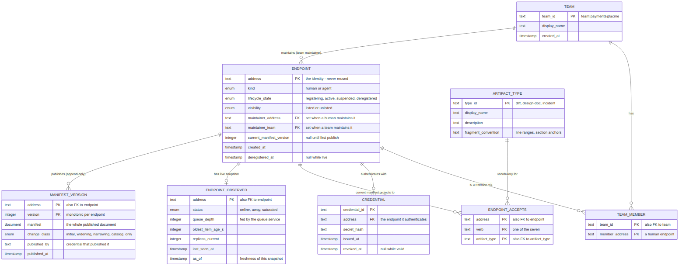

# Registry — endpoint data model (phase 1)

**Status:** Draft — proposed for review. Design-level only: entities, relationships, and the reasoning behind them. No DDL, no indexes, no migrations.
**Milestone:** M0 — Discovery, Requirements & System Design
**Asana:** [Registry / Directory — flow & requirements](https://app.asana.com/1/1216510645821595/task/1216509527222161)
**Inherits from:** [architecture.md](architecture.md) §3.2 (Registry), §3.4 (Queues), §6 (identity model), §9 (NFRs)

---

## 1. What this phase decides

**How an endpoint is represented in the database** — nothing else. The Registry work is split into three phases because the decisions constrain each other and reviewing them together is unproductive:

| Phase | Question | Status |
|---|---|---|
| **1 — this document** | What is an endpoint, as stored data? | Draft |
| 2 | What calls exist against it, and in what style (REST / GraphQL)? | Not started |
| 3 | Dual-consumer design: humans on the console talking to an assistant or an agent; agents reaching the system over MCP | Not started |

Phase 1 is deliberately API-agnostic. If a modelling choice here forces phase 2's hand, that's a bug in this document — it's called out in §7 where it happens.

## 2. The ground this rests on

Facts from the ratified architecture that the model has to satisfy. Stated inline so this document stands alone.

1. **The address is the identity.** A flat, org-scoped namespace: `varsha@acme` (human), `payments-review@acme` (team-owned agent), `review-agent@varsha.acme` (personal agent). Addresses are stable; what sits behind them changes freely (§6).
2. **Humans and agents are co-equal endpoints** with the same protocol surface. The differences are presentation and manifest shape, not kind of thing (§6).
3. **Every endpoint publishes a capability manifest** — accepted verbs, artifact types, maintainer, and the human-readable purpose description a colleague needs in order to choose it (§3.2).
4. **Manifests are replaced whole, not patched.** An endpoint publishes the manifest it wants to be true.
5. **The manifest serves two different readers**: the Exchange, matching a `(verb, artifact_type)` pair at handshake, and a human deciding where to send work. These are different queries over the same document.
6. **Queues are switchboard-owned** (§3.4). An endpoint declares the depth at which it considers itself saturated; the live depth is the switchboard's fact, not the endpoint's.
7. **The Registry never calls endpoints** (§3.1). Anything it knows about liveness arrived from somewhere else.
8. **Scale is small**: ~50 endpoints, design ceiling 200; resolve plus manifest read ≤ 100 ms p95, on the hot path of every offer (§9.1, §9.2).

## 3. Entity overview

Diagram source: [diagrams/registry-erd.mmd](diagrams/registry-erd.mmd)

| Entity | What it holds | Churn |
|---|---|---|
| `endpoint` | Identity and administrative state. One row per address, forever. | Very low |
| `manifest_version` | Every manifest ever published. Append-only. | Low (per deploy) |
| `endpoint_accepts` | Derived projection of the *current* manifest for capability matching. | Rebuilt on publish |
| `endpoint_observed` | Live status and queue depth. Disposable. | Very high |
| `credential` | Per-endpoint authentication material. | Very low |
| `team` / `team_member` | Who may act on a team-owned endpoint's behalf. | Very low |
| `artifact_type` | The org's artifact vocabulary. | Very low |

The churn column is the design's spine: four orders of magnitude separate `endpoint_observed` from `endpoint`, and mixing them in one row is the mistake this model exists to avoid.

## 4. Entities in detail

### 4.1 `endpoint`

The identity row. One per address, created at registration and never deleted.

| Field | Type | Notes |
|---|---|---|
| `address` | text, PK | The identity. Lowercase, constrained to the same grammar the envelope uses. |
| `kind` | enum | `human` \| `agent`. A field, not a separate table — see §5.1. |
| `lifecycle_state` | enum | `registering` \| `active` \| `suspended` \| `deregistered`. |
| `visibility` | enum | `listed` \| `unlisted`. Affects browse only, never resolution. |
| `maintainer_address` | text, FK → `endpoint` | Set when a human maintains it. |
| `maintainer_team` | text, FK → `team` | Set when a team maintains it. Exactly one of the two is set. |
| `current_manifest_version` | integer | Points into `manifest_version`. Null until the first publish. |
| `created_at` | timestamp | |
| `deregistered_at` | timestamp | Null while live. Non-null means tombstoned. |

An endpoint with `current_manifest_version` null is `registering`: the address is claimed, but the endpoint is invisible and undialable. That is the correct state for a half-built agent, and it costs nobody but its owner.

### 4.2 `manifest_version`

Every manifest ever published, one row each, never updated.

| Field | Type | Notes |
|---|---|---|
| `address` | text, PK/FK | |
| `version` | integer, PK | Monotonic per endpoint. Registry-assigned; endpoints never set it. |
| `manifest` | document | The whole published document, as published. |
| `change_class` | enum | `initial` \| `widening` \| `narrowing` \| `catalog_only`, computed at publish (§5.2). |
| `published_by` | text | The credential that published it — so "who changed this agent's capabilities" is answerable. |
| `published_at` | timestamp | |

The manifest is stored as a **document**, not decomposed into columns. Its field-level schema is deliberately out of scope for phase 1 — see §7.

### 4.3 `endpoint_accepts`

A derived projection of the current manifest: one row per `(address, verb, artifact_type)` the endpoint accepts. Rebuilt from the manifest on every publish, in the same transaction that writes the version.

Not authoritative. If it disagrees with the manifest document, the document wins and the projection is rebuilt.

### 4.4 `endpoint_observed`

One row per endpoint, overwritten constantly: `status` (`online`/`away`/`saturated`), `queue_depth`, `oldest_item_age_s`, `replicas_current`, `last_seen_at`, `as_of`.

Fed from outside the Registry — depth and saturation from the Queue service, liveness from handshake outcomes and inbound heartbeats (§2.7). **Deliberately disposable**: if this table were dropped, the switchboard would keep working and every row would rebuild within seconds. Nothing here is ever versioned, audited, or recovered.

### 4.5 `credential`, `team`, `team_member`, `artifact_type`

- **`credential`** — per-endpoint auth material, stored hashed, with `issued_at` and a nullable `revoked_at`. Multiple live rows per endpoint is what makes rotation-without-downtime possible later.
- **`team`** — `team_id` (`team:payments@acme`), display name. **Teams are not endpoints**: no address in the endpoint namespace, no manifest, no queue. They exist only to answer "which humans may act for this endpoint."
- **`team_member`** — team to human-endpoint membership.
- **`artifact_type`** — the org's vocabulary (`diff`, `design-doc`, `incident`), each with a display name, description, and its fragment convention (`#L40-L60` for diffs, `#section-name` for docs). Referenced by `endpoint_accepts`, which is what stops one side saying `diff` while the other says `patch`.

## 5. Modelling decisions

The substance of this review. Each is a call that could reasonably have gone the other way.

### 5.1 The address is the primary key — no surrogate ID

The address *is* the identity, so it is the key. Two consequences fall out for free:

- **Tombstoning needs no machinery.** A deregistered endpoint keeps its row with `deregistered_at` set, and primary-key uniqueness alone guarantees the address is never reissued. This matters because the ledger references addresses permanently — reusing one would make history lie about who did what.
- **Every foreign key is human-readable**, which makes the ledger and the directory legible without joins.

*Rejected:* surrogate UUID with a unique constraint on address. It needs a separate mechanism to prevent reuse, and buys renameability the product explicitly doesn't want.
*Accepted cost:* a text key up to 254 characters propagates into every referencing table. At 50–200 endpoints this is not worth optimising, and saying so now prevents someone in M2 "fixing" it.

### 5.2 Manifests are append-only versions, not a mutable column

One row per publish, never updated. This is more storage for a document that could just be overwritten, and it buys three things that are otherwise expensive:

1. **History for free.** "What could this agent do last Tuesday" is a query, not an archaeology project.
2. **Narrowing is computable.** Diffing against the previous version classifies each publish as widening or narrowing. That matters because the Orchestrator accepts standing offers against a manifest and then enqueues directly without re-handshaking — so an endpoint quietly dropping a verb can break workflows that were validated when they were created. Storing `change_class` at publish time is what lets that be detected rather than discovered at runtime.
3. **Handshake provenance.** A recorded offer can name the manifest version it was evaluated against.

*Growth check:* an agent republishing on every deploy, 20 deploys a day, produces ~7,300 small rows a year. At the pilot's 50 endpoints this is negligible; compaction becomes a real question only if manifests get large, and they are metadata about an endpoint rather than work products — the size cap that keeps them that way is a phase 2 concern.

### 5.3 The document is canonical; query structures are derived

The manifest document is the truth. `endpoint_accepts` and the catalog text index are materialised from it on publish.

This exists because the same document answers two unrelated questions:

| Reader | Question | What it needs |
|---|---|---|
| Exchange, at handshake | Does this endpoint accept `request` carrying `diff`? | Exact match, indexed, ≤ 100 ms |
| A human (or their assistant) | Which endpoint should see this PR? | Fuzzy text over purpose descriptions |

Neither is served by scanning documents. Rather than distort the manifest to suit one reader, the document stays as published and each reader gets a structure shaped for it — rebuilt transactionally so they cannot drift.

This is the dual-consumer split of phase 3 showing up two phases early. It is a good sign: the two audiences are a real property of the system, not a UI concern.

### 5.4 Observed state is separate, unversioned, and disposable

Queue depth changes thousands of times more often than anything else about an endpoint. Putting it on the `endpoint` row would mean rewriting the identity row constantly, and versioning it would mean an audit trail of numbers nobody will ever query.

It is also **not the endpoint's claim** — the switchboard owns the queues, so the switchboard owns the depth. The endpoint declares its saturation ceiling inside its manifest; the live number lives here. The pair is what makes `saturated` meaningful.

Every read carries `as_of`, and consumers must treat it as advisory: an endpoint showing `online` can still decline, because acceptance is always the endpoint's decision.

### 5.5 Lifecycle state and operational status are different columns

`lifecycle_state` is administrative and changes deliberately. `status` is observed and changes on its own. A **saturated endpoint is healthy and working**; a suspended one is not. Collapsing these into one enum is the most likely modelling error here, which is why they live in different tables entirely.

### 5.6 Maintainer polymorphism: two nullable columns

`maintainer_address` and `maintainer_team`, exactly one set, enforced by a constraint.

*Rejected:* a shared `principal` table that humans and teams both project into. It is the textbook answer and it would add a join to a lookup performed on the hot path, to model a two-case union that has been stable since the brief. If teams later grow structure (nesting, roles, on-call rotations), this is the seam to revisit.

### 5.7 Two facts the Directory shows are owned by other services

The console mock's Directory drawer displays **"Referenced by — 2 workflows"** alongside the manifest. That is a reverse lookup from an endpoint to the workflow definitions holding standing offers against it, and it is Orchestrator-owned: the Registry has no table that answers it and should not grow one, because standing offers are created and invalidated by workflow lifecycle, not endpoint lifecycle.

It is the same shape as live queue depth (§5.4) — a fact from another service composed onto a Registry surface at read time. Two instances make it a pattern worth naming now: **the Directory is a composition of three services' data, not a Registry view.** Phase 2 has to decide where that composition happens (a Registry endpoint that fans out, or a client that calls three services), which is exactly the kind of question phase 1 should hand over rather than pre-empt.

### 5.8 Registry events belong in the Ledger, not a private audit table

Registration, manifest publication, ownership transfer, suspension, deregistration — all of these are audit facts. The Ledger's current scope is "every session, offer, and envelope", which none of them are.

The model deliberately does **not** define a `registry_event` table, because inventing a second audit log would undercut the Ledger's completeness guarantee. **This is an open ask of the Ledger story**, and it is the one place phase 1 depends on a decision it cannot make alone. In the meantime `manifest_version` carries `published_by` and `published_at`, which covers the most valuable slice.

## 6. Query paths

The model is falsifiable here: every read the Registry must serve, and the structure behind it. A path with no structure means the model is wrong.

| # | Read pattern | Consumer | Served by |
|---|---|---|---|
| 1 | Resolve one address + its current manifest | Exchange (hot path, ≤ 100 ms) | `endpoint` by PK → `manifest_version` by `(address, current_manifest_version)` |
| 2 | Does this endpoint accept `(verb, artifact_type)`? | Exchange, at handshake | `endpoint_accepts` exact lookup |
| 3 | Which endpoints accept `(verb, artifact_type)`? | Agent discovery | `endpoint_accepts` filtered to active + listed |
| 4 | The default directory list | Console | `endpoint` filtered to `active` + `listed` |
| 5 | Free-text search over purpose | Human, or an assistant acting for one | Catalog text index over the current manifest |
| 6 | Endpoints I maintain | Console | `endpoint` by maintainer, or via `team_member` |
| 7 | Live status and depth for a set of endpoints | Console | `endpoint_observed` by address |
| 8 | What could this endpoint do at version N? | Orchestrator, audit | `manifest_version` by `(address, version)` |
| 9 | May this human act for this endpoint? | Authorization on every mutation | `endpoint.maintainer_*`, then `team_member` |
| 10 | Is this address available? | Registration | `endpoint` by PK — tombstones included, which is the point |
| 11 | Which workflows reference this endpoint? | Console (the mock's "Referenced by") | **Nothing here** — Orchestrator-owned, composed at read time (§5.7) |

Paths 2 and 5 are why §5.3 exists. Path 10 is why §5.1 exists. Path 11 is deliberately unserved: it is in the table so that the composition question reaches phase 2 rather than being discovered when the Directory is built.

## 7. Explicitly not decided here

So reviewers know what they are not being asked to approve:

- **API shape** — resource paths, REST vs GraphQL, pagination, error shapes → **phase 2**.
- **Consumer surfaces** — the MCP surface agents reach the system through, and an assistant-mediated console → **phase 3**. Note this extends the ratified reference stack (§10 of the architecture: HTTPS + JSON, signed webhooks, agents pull queues), so it needs a written reason when phase 2 or 3 gets there.
- **Field-level manifest schema** — phase 1 treats the manifest as an opaque versioned document on purpose. A draft schema exists (commit `540158f`, superseded PR #3) and re-lands with phase 2, where request and response shapes need it.
- **Physical design** — DDL, index definitions, column types, migrations, and whether `endpoint_observed` is a table at all or an in-memory cache. All build-time (M2).
- **The Queue → Registry feed mechanism** for observed fields — owned by the Queues story.
- **Directory UX.** The console mock is now in hand, and it leads each row with the *address* and shows the drawer as a raw "Capability manifest" — verbs and artifact types, no purpose description. That is the machine-facing directory the product brief names as its open gap, rendered. Reconciling it is a phase 3 question, since it turns on who the human consumer actually is (someone browsing a table, or someone asking an assistant). The data model supports either: purpose text lives in the manifest document and is reachable via path 5 whether or not the current UI reads it.

## 8. Open questions

1. **Does `endpoint_observed` need to be durable at all?** It is disposable by construction, so a cache would do — but the ratified stack has no cache tier and a $50/month ceiling, which argues for a plain table. Physical-design call, flagged because it may affect the entity list.
2. **Manifest version retention.** Keep every version forever (proposed), or compact old ones once no standing offer references them?
3. **Do credentials belong to the Registry at all**, or to a separate identity concern that the Registry references?
4. **Is `change_class` computed at publish and stored, or derived on demand?** Stored is proposed, so the classification can't change retroactively as diffing logic evolves.
5. **Should `endpoint_accepts` be versioned alongside the manifest**, or remain a current-only projection? Current-only is proposed; path 8 already answers historical questions from the document.
6. **Registry events in the Ledger** (§5.8) — needs a decision from the Ledger story before M2.
